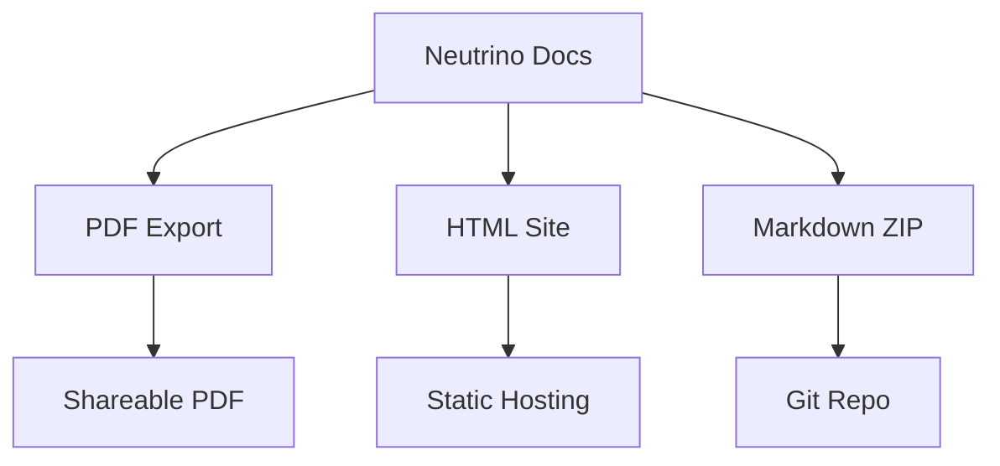

## Overview

Neutrino provides a comprehensive suite of tools to streamline your documentation workflow. You can create, edit, collaborate, and publish docs efficiently. This guide covers the core features that power your documentation space, from basic editing to advanced exporting.

<Callout kind="info">
Neutrino handles everything from rich text editing to version history, making it ideal for technical teams.
</Callout>

## Key Features

Discover the essential capabilities at a glance.

<Columns cols={3}>
  <Card title="Document Creation" icon="file-text" href="#document-creation">
    Build pages with intuitive editors and structured templates.
  </Card>
  <Card title="Version Control" icon="git-branch" href="#version-control">
    Track changes with full history and rollback options.
  </Card>
  <Card title="Search & Indexing" icon="search" href="#search">
    Find content instantly across your entire doc site.
  </Card>
  <Card title="Templates & Formatting" icon="palette" href="#templates">
    Customize with reusable templates and styling options.
  </Card>
  <Card title="Export Options" icon="download" href="#export" horizontal>
    Publish in multiple formats for any platform.
  </Card>
</Columns>

## Document Creation and Editing

Start new documents with ease using Neutrino's WYSIWYG editor or markdown mode.

### Quick Start Workflow

<Steps>
  <Step title="Create New Page" icon="plus">
    Navigate to your workspace and select <kbd>New Page</kbd>.
  </Step>
  <Step title="Choose Template" icon="layout">
    Pick from blank, API reference, or guide templates.
  </Step>
  <Step title="Edit Content" icon="edit-3">
    
````markdown
# My New Doc

Add your content here. Use **bold** for emphasis and `code` for snippets.
````
    
  </Step>
  <Step title="Publish" icon="upload">
    Save and publish to make it live.
  </Step>
</Steps>

## Version Control and History Tracking

Neutrino automatically saves versions, allowing you to compare changes and revert if needed.

<Expandable title="View Change History" default-open="true">
  Access history via the page menu. Each version includes:
  
  | Change Type | Author | Timestamp |
  |-------------|--------|-----------|
  | Edit       | you@example.com | 2024-10-15 14:30 |
  | Rename     | team@neutrino.dev | 2024-10-14 09:15 |
  
  Restore any version with one click.
</Expandable>

## Search and Indexing

Built-in search indexes your content in real-time.

<Tabs>
  <Tab title="Basic Search" icon="search">
    Type keywords to find pages instantly.
  </Tab>
  <Tab title="Advanced Filters" icon="filter">
    Filter by tags, date, or author.
    
    <Callout kind="tip">
      Use quotes for exact phrases: `"API integration"`.
    </Callout>
  </Tab>
</Tabs>

## Templates and Formatting Options

Customize your docs with pre-built templates and MDX components.

<CodeGroup tabs="Markdown,MDX">
````markdown
## Heading

- List item
- Another item

```javascript
console.log('Hello, Neutrino!');
```
````
````mdx
<Callout kind="success">
Great job!
</Callout>

```javascript
console.log('Hello, Neutrino!');
```
````
</CodeGroup>

## Exporting Documentation Formats

Export your docs to various formats for sharing or archiving.



<Callout kind="tip">
For production deploys, use the HTML export with your brand color `#3B82F6`.
</Callout>