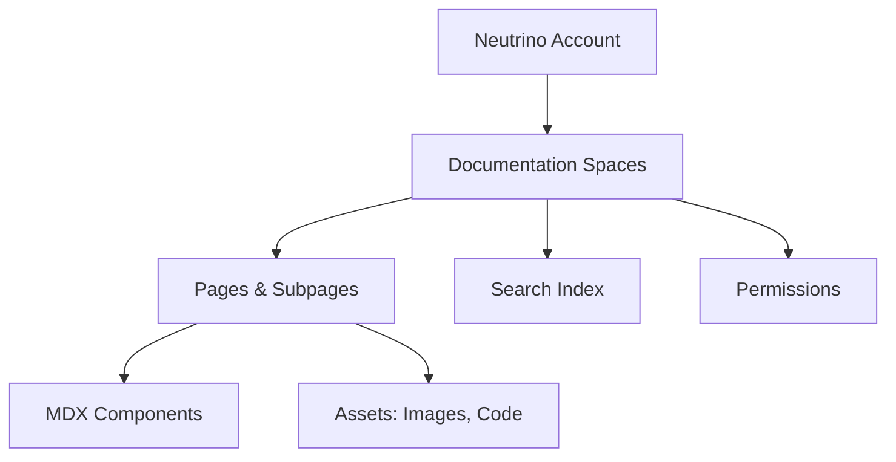

<Callout kind="info" title="Starter Kit Template">
  This documentation was generated as a starter kit template based on your brand. Please review and customize the content to accurately reflect your product's features, APIs, and capabilities.
</Callout>

## Overview

Neutrino provides a centralized space to organize, manage, and collaborate on your project documentation. You create custom documentation spaces tailored to your teams and projects, making it easy to maintain up-to-date guides, API references, and tutorials. Benefit from powerful search, version control integration, and seamless sharing to streamline your workflow.

Neutrino scales with your needs, whether you document a single app or an entire product suite. Focus on content creation while Neutrino handles structure, permissions, and accessibility.

## Key Features

<Columns cols={3}>
  <Card title="Documentation Spaces" icon="folder-open">
    Organize content into dedicated spaces for projects, teams, or products. Each space supports nested pages, custom navigation, and role-based access.
  </Card>
  <Card title="Rich Editing" icon="edit-3">
    Use Markdown, MDX components, and live previews to create interactive docs. Embed code examples, diagrams, and media effortlessly.
  </Card>
  <Card title="Search & Navigation" icon="search">
    Full-text search across all spaces with smart filtering. Intuitive sidebar navigation keeps you oriented in large docs.
  </Card>
  <Card title="Collaboration" icon="users">
    Real-time editing, comments, and version history. Integrate with GitHub for pull request previews.
  </Card>
  <Card title="Customizable Themes" icon="palette">
    Apply your brand colors and layouts. Export to static sites or embed in apps.
  </Card>
  <Card title="Analytics" icon="bar-chart-3">
    Track page views and engagement to refine your documentation strategy.
  </Card>
</Columns>

## Who Should Use Neutrino

<Tabs>
  <Tab title="Developers & Engineers" icon="code">
    Build API references, SDK guides, and troubleshooting docs. Use code tabs and request/response examples for technical accuracy.
  </Tab>
  <Tab title="Product Managers" icon="package">
    Centralize user guides, onboarding flows, and feature roadmaps. Share live previews without coding.
  </Tab>
  <Tab title="Teams & Enterprises" icon="users">
    Manage multi-project docs with permissions and audit logs. Scale to hundreds of pages across departments.
  </Tab>
</Tabs>

## Quick Start

Follow these steps to set up your first documentation space.

<Steps>
  <Step title="Sign Up" icon="user-plus">
    Create a free account at `https://app.neutrino.dev/register`. No credit card required.
  </Step>
  <Step title="Create a Space" icon="plus">
    Click "New Space" and name it, like "My Project Docs". Add a description and team members.
  </Step>
  <Step title="Add Your First Page" icon="file-plus">
    Create a page with Markdown. Here's a starter example:
    
    <CodeGroup tabs="Markdown,MDX">
      ```markdown
      # Welcome
      
      This is your first doc page.
      
      ## Quick Links
      - [API Reference](/api)
      - [Changelog](/changelog)
      ```
      ```mdx
      # Welcome
      
      <Callout kind="success">
        Great job creating your first MDX page!
      </Callout>
      
      ## Quick Links
      - [API Reference](/api)
      - [Changelog](/changelog)
      ```
    </CodeGroup>
  </Step>
  <Step title="Publish & Share" icon="share-2">
    Hit publish and share the space URL. Customize permissions for viewers and editors.
  </Step>
</Steps>

## Basic Architecture

Neutrino uses a hierarchical structure for your docs:



Spaces contain pages with nested subpages. Components like tabs and cards enhance interactivity.

## Next Steps

<Columns cols={2}>
  <Card title="Quickstart Guide" icon="zap" href="/quickstart">
    Dive into advanced setup and first integrations.
  </Card>
  <Card title="Authentication" icon="shield" href="/authentication">
    Secure your spaces with API keys and SSO.
  </Card>
  <Card title="Customization" icon="settings" href="/configuration">
    Tailor themes, layouts, and workflows.
  </Card>
  <Card title="Changelog" icon="git-branch" href="/changelog">
    See what's new in recent releases.
  </Card>
</Columns>

<Callout kind="tip">
  Explore the quickstart next to build your first space in under 5 minutes.
</Callout>