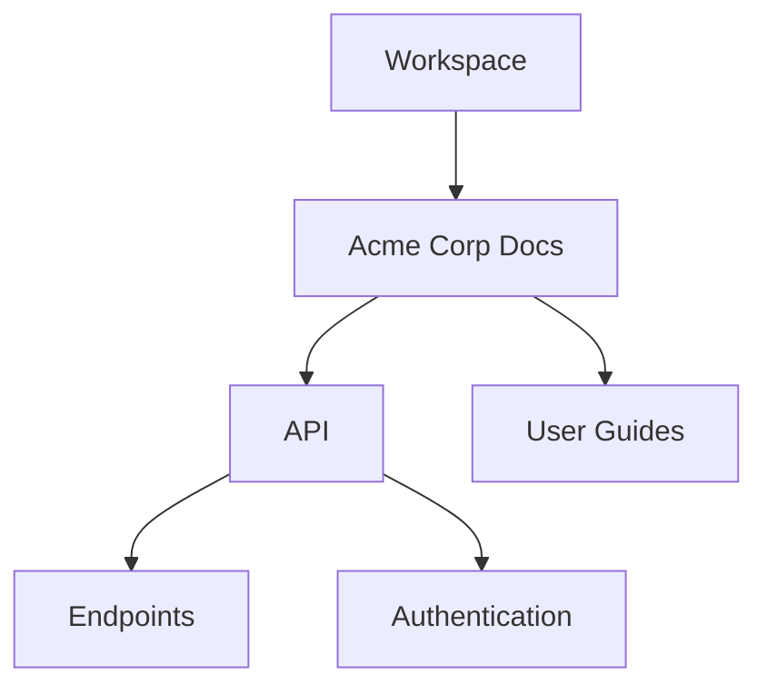

## Overview

Neutrino provides flexible tools to organize your documentation across multiple projects. You can create folder hierarchies, apply tags for quick searching, set team permissions, link related pages, and archive old content. This guide walks you through each step to keep your docs efficient and collaborative.

<Callout kind="info">
Use folders and tags together for the best organization. Folders handle structure, while tags enable dynamic filtering across projects.
</Callout>

## Setting Up Project Folders and Hierarchies

Start by creating a clear folder structure to mirror your projects. Neutrino supports nested folders up to five levels deep.

<Steps>
  <Step title="Create a Root Folder" icon="folder">
    Navigate to your workspace dashboard. Click the <kbd>New</kbd> button and select `Folder`. Name it after your main project, like `Acme Corp Docs`.
  </Step>
  <Step title="Add Subfolders" icon="folder-plus">
    Inside the root folder, create subfolders for categories such as `API`, `User Guides`, and `Changelogs`.
  </Step>
  <Step title="Nest Deeper Levels" icon="folder-open">
    For complex projects, add levels like `API/{endpoints,authentication}`. Drag and drop to reorder.
  </Step>
</Steps>



## Tagging and Categorizing Documents

Tags help you categorize and search docs beyond folder structure. Apply them via the UI or YAML frontmatter.

<Tabs>
  <Tab title="UI Tagging" icon="tag">
    Open a document, click the `Tags` panel, and add labels like `feature`, `beta`, or `team:engineering`. Tags auto-suggest based on usage.
  </Tab>
  <Tab title="YAML Frontmatter" icon="code">
    Add tags directly in your MDX files:

    ````mdx
    ---
    title: API Endpoints
    tags: ["api", "reference", "v2"]
    ---
    ````

    Save to sync tags automatically.
  </Tab>
</Tabs>

## Managing Access Permissions for Teams

Control who sees and edits docs with role-based permissions. Assign at folder or document level.

| Role       | View | Edit | Admin |
|------------|------|------|-------|
| Viewer     | ✅   | ❌   | ❌    |
| Editor     | ✅   | ✅   | ❌    |
| Admin      | ✅   | ✅   | ✅    |

<Columns cols={2}>
  <Card title="Folder Permissions" icon="shield" href="#folder-permissions">
    Set inheritance for subfolders to save time.
  </Card>
  <Card title="Document Overrides" icon="lock" href="#doc-permissions">
    Override folder settings for sensitive pages.
  </Card>
</Columns>

To apply via API:

<CodeGroup tabs="cURL,JavaScript">
  ```bash
  curl -X POST https://api.example.com/v1/folders/{folderId}/permissions \
    -H "Authorization: Bearer YOUR_TOKEN" \
    -d '{"userId": "123", "role": "editor"}'
  ```
  ```javascript
  const response = await fetch(`https://api.example.com/v1/folders/${folderId}/permissions`, {
    method: 'POST',
    headers: {
      'Authorization': `Bearer ${YOUR_TOKEN}`,
      'Content-Type': 'application/json'
    },
    body: JSON.stringify({ userId: '123', role: 'editor' })
  });
  ```
</CodeGroup>

<ParamField path="folderId" param-type="string" required="true">
  Unique folder identifier.
</ParamField>

<ParamField header="Authorization" param-type="string" required="true">
  Bearer token for authentication.
</ParamField>

## Linking Between Documents and Pages

Create seamless navigation with internal links. Use relative paths for portability.

<CodeGroup tabs="MDX,HTML">
  ```mdx
  [Go to Authentication](/docs/authentication)

  [Anchor Link](#permissions-section)

  Embed page: 
  ```
  ```html
  <a href="/docs/organization#folders">Folders Section</a>
  ```
</CodeGroup>

## Archiving Outdated Content

Keep your active docs clean by archiving old versions.

<Expandable title="Archiving Steps" default-open="true">
  <Steps>
    <Step title="Move to Archive" icon="archive">
      Select documents, click `Archive`. They move to a hidden `/archive` folder.
    </Step>
    <Step title="Restore if Needed" icon="rotate-cw">
      Search archived docs and click `Restore`.
    </Step>
  </Steps>
</Expandable>

<Expandable title="Advanced: Bulk Operations">
  Use the API for large-scale archiving:

  ```bash
  curl -X POST https://api.example.com/v1/bulk-archive \
    -H "Authorization: Bearer YOUR_TOKEN" \
    -d '["doc1", "doc2"]'
  ```
</Expandable>

<Callout kind="tip">
Review archives quarterly to delete truly obsolete content and maintain performance.
</Callout>